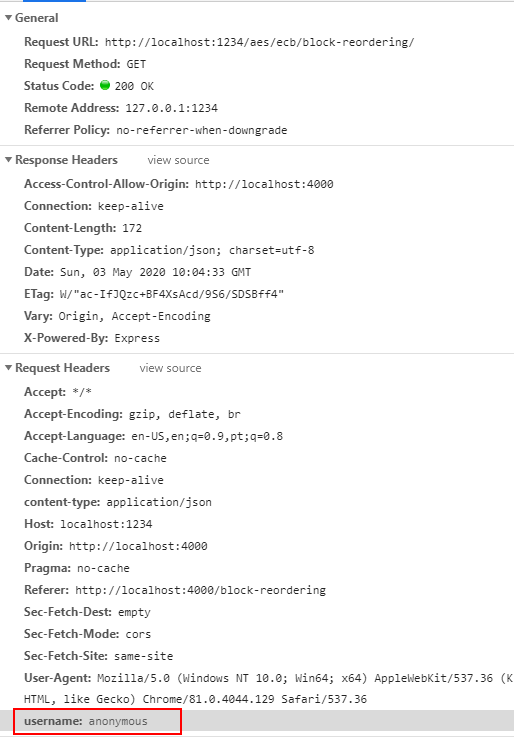

# Block Reordering

As we covered before in [Block CIphers](block-ciphers) each block of the data is encrypted individually. The problem with this, is that you can manipulate each block individually as you which and decryption will just work
If you have an idea of the content being encrypted and you can manipulate it, this can be used to change parts of the encrypted content that you should not be able to.

## The Basics

Again, as each block is encrypted individually you can just reorganize them in any order you want to. If you have input that goes to the encrypted content you can use that input as well to create new blocks, with the same content as other blocks that you want to manipulate, then you can use the blocks you 'created' and just put them to replace to old values. This seems a little bit confusing, so lets see how it works with an example

## Solving the challenge

In the case presented in this challenge the objective is to do a privilege escalation, going form a regular user to admin, just with block reordering.

When you open the challenge for the first time an extra request is done to the server, to create a session for you.
Take a look at the request made and you will notice the username is being sent, and in this case, as 'anonymous'



Also, in the challenge page you have a very important help. The format of the token being encrypted and sent to the view is:

```plaintext
username=[USERNAME];isAdmin=false;aat=[DATE]
```

So an example of the content being encrypted is:

```plaintext
username=anonymous;isAdmin=false;at=Sun, 03 May 2020 11:28:26 GMT
```

And the response for the initial request is a new token like this one:

```plaintext
d9d440cf193570eadf170a93dfc5a96e1e09d930a1e327459c045d8c7033a45d7ea77ca50f8efc758a92bf38cf04bad1b0cc0d5ddb8478ef5983b527067b28a83f3641cafb65b9b96098f222482c752e
```

So who can this be used in an attack?

As seen before, in block ciphers the content is broken into smaller blocks. For AES Usually 128 or 256 bits (16 or 32 bytes)
And since the token that you received is in HEX, each byte is basically represented by two characters.

So breaking the token into the blocks used you get this:

```plaintext
d9d440cf193570eadf170a93dfc5a96e | username=anonymo
1e09d930a1e327459c045d8c7033a45d | us;isAdmin=false
7ea77ca50f8efc758a92bf38cf04bad1 | ;at=Sun, 03 May
b0cc0d5ddb8478ef5983b527067b28a8 | 2020 11:28:26 GM
3f3641cafb65b9b96098f222482c752e | T...............
```

The 'anonymous' username is sent with the initial request, so we can manipulate it.
But what we really want it to change that isAdmin from false to true...

Notice what happens when we change the username to lets say **ABCDEFGHIJKLMNOPQRSTUVWXYZ12**
This can be done by intercepting the request with a proxy (out of scope of this doc)

```plaintext
c5f3c7a7d06f6b3bac89a4ab710fbd20 | username=ABCDEFG
e87a128a9d791dd8c90fc0a3de197596 | HIJKLMNOPQRSTUVW
e57c89c779b365b46908ffc86610077c | XY;isAdmin=false
7ea77ca50f8efc758a92bf38cf04bad1 | ;at=Sun, 03 May
4d2fb957295b10bc4c6d1c49c278cd9a | 2020 12:40:27 GM
3f3641cafb65b9b96098f222482c752e | T...............
```

As you can see we have created a new block...Now we use the username to produce a block with the same content as the one we want to manipulate...

We want to change the block:

```plaintext
XY;isAdmin=false
```

To:

```plaintext
XY;isAdmin=true
```

If we send this content in the username we will get it encrypted for us.
So lets change the name now to **ABCDEFGAA;isAdmin=true;A**

This is the token the server will encrypt:

```plaintext
username=ABCDEFGAA;isAdmin=true;A;isAdmin=false;at=Sun, 03 May 2020 13:09:18 GMT
```

```plaintext
c5f3c7a7d06f6b3bac89a4ab710fbd20 | username=ABCDEFG
19ee3588859ef7db3c720d891b177b83 | AA;isAdmin=true;
110b78696d7379b51d0367bd24138adc | A;isAdmin=false;
f0a35c2fa93bd1bd17644b3b57d34921 | at=Sun, 03 May 2
7d6712c2e78ab5e1dd20c98f7d332bb0 | 020 13:09:18 GMT
67fae7fa46b1dd72844f7a4c802c8eaa | ................
```

Ok, good, if you just delete the third line, which is the one from the original content injected by the application

```plaintext
c5f3c7a7d06f6b3bac89a4ab710fbd20 | username=ABCDEFG
19ee3588859ef7db3c720d891b177b83 | AA;isAdmin=true;
f0a35c2fa93bd1bd17644b3b57d34921 | at=Sun, 03 May 2
7d6712c2e78ab5e1dd20c98f7d332bb0 | 020 13:09:18 GMT
67fae7fa46b1dd72844f7a4c802c8eaa | ................
```

You end up with the following token:

```plaintext
c5f3c7a7d06f6b3bac89a4ab710fbd2019ee3588859ef7db3c720d891b177b83f0a35c2fa93bd1bd17644b3b57d349217d6712c2e78ab5e1dd20c98f7d332bb067fae7fa46b1dd72844f7a4c802c8eaa
```

Now you just need to replace this token with the original one which is in localstorage and refresh the page. You are now admin.

## Lesson Learned
